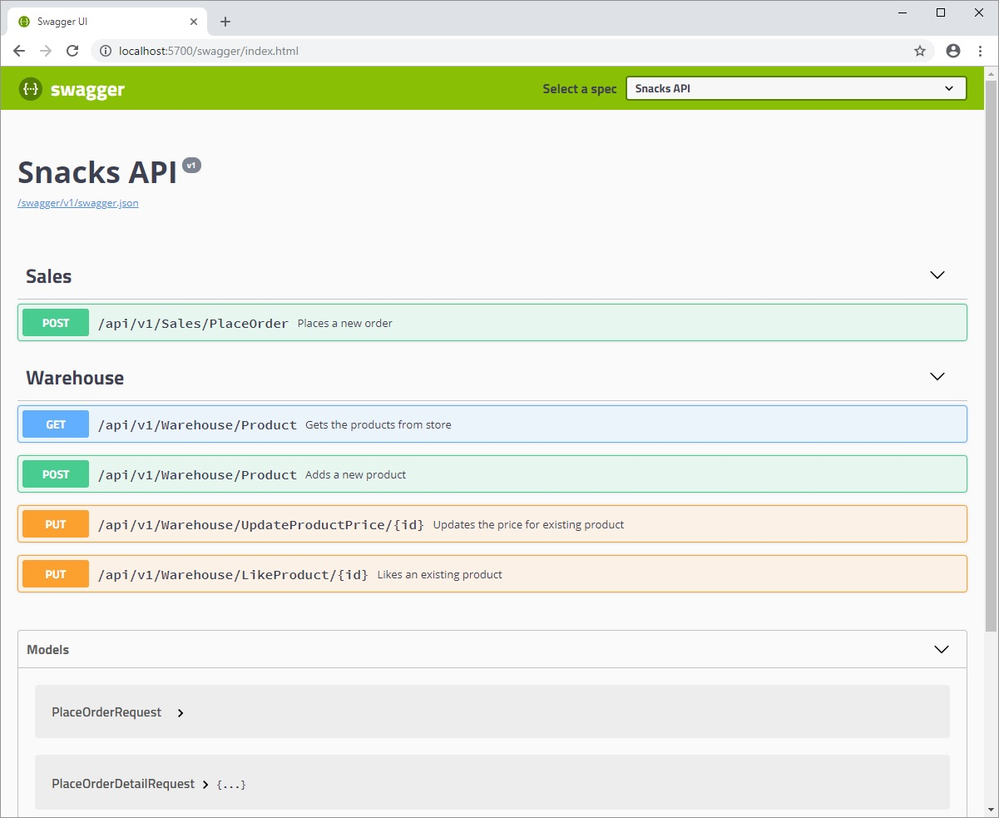
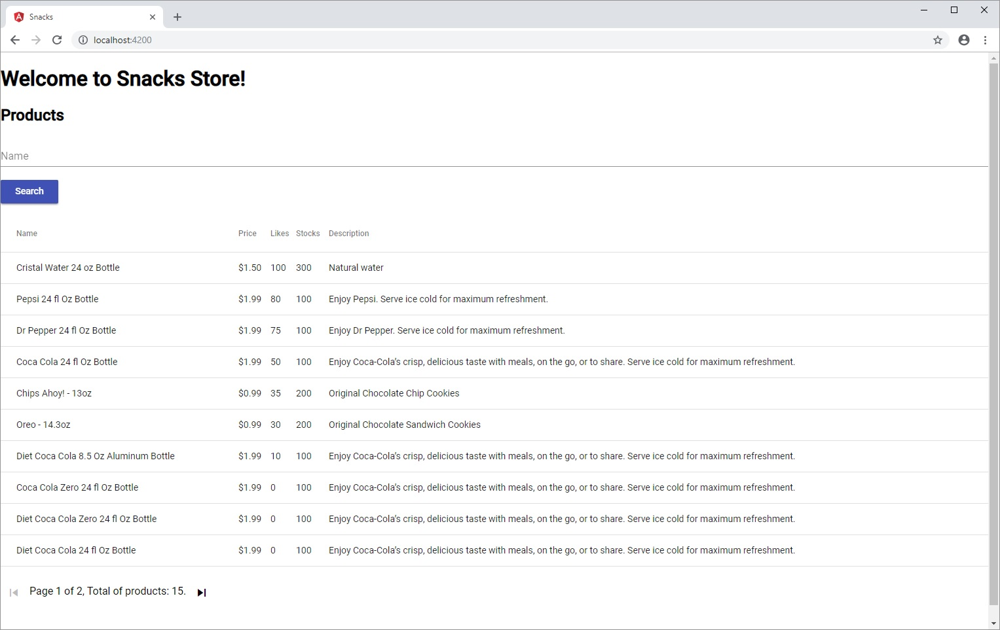

# CodeChallenge

This is the repository for *Snacks API* Code Challenge.

## Technologies

This solution is built with the following technologies:

### Back-end

* ASP.NET Core
* Entity Framework Core

### Front-end

* Angular 6
* Angular Material 6

## Executing Solution

## Prerequisites

In order to run this solution, install the following components:

* .NET Core
* NodeJS
* Angular CLI

### First Run

If is the first run, execute *build.bat* file inside of *SourceCode* directory.

Then execute *deploy.bat* file from *Database* directory.

*To deploy database script, you need access to SQL Server instance.*

### Running Solution

Execute *run.bat* file inside of *SourceCode* directory.

* **AuthAPI** project runs on *5600* port.
* **API** project runs on *5700* port.
* Angular client runs on *4200* port.

#### API Help Page

Open *http://localhost:5700/swagger/index.html* url in browser:

#### Client

Open *http://localhost:4200/* url in browser:

### Tests

There is a collection for Postman Inside of *Tests* directory.
