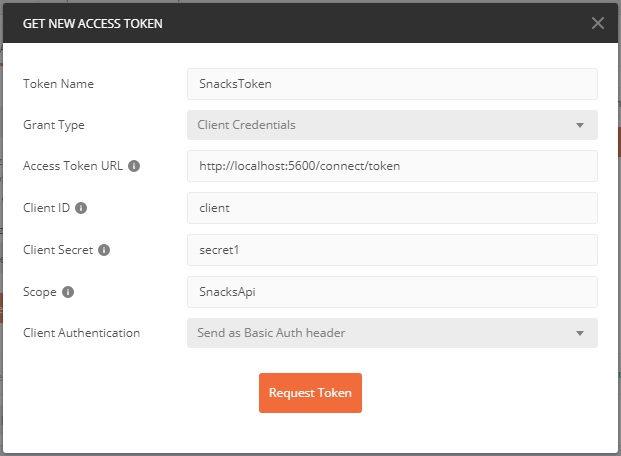

# Tests for Snacks API

Store API.postman_collection.json file contains the following tests for Snacks API:

|Name|Requires Authentication|Description|
|----|-----------------------|-----------|
|Get Products|No|Retrieves products|
|Get Products by Name|No|Retrieves products filtering by name|
|Add Product|Yes|Adds a product|
|Update Price for Product|Yes|Updates price for existing product|
|Like Product|Yes|Likes an existing product|
|Place Order|Yes|Places a new order|

To get a valid token for tests, use these values once you have running Auth API:

|Parameter|Value|
|---------|-----|
|Token Name|Token name|
|Grant Type|Client Credentials|
|Access Token URL|http://localhost:5600/connect/token|
|Client ID|client|
|Client Secret|secret1|
|Scope|SnacksApi|
|Client Authentication|Send as Basic Auth Header|

