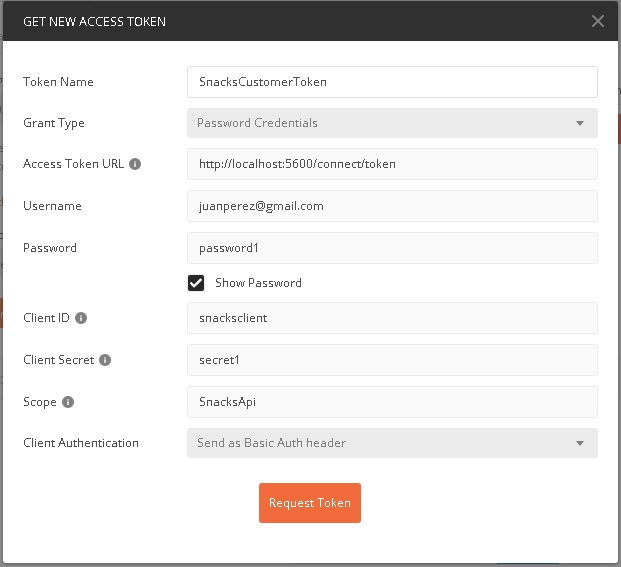

# Tests for Snacks API

*Store API.postman_collection.json* file contains the following tests for **Snacks API**:

|Name|Requires Authentication|Role|Description|
|----|-----------------------|----|-----------|
|Get Products|No|None|Retrieves products|
|Get Products by Name|No|None|Retrieves products filtering by name|
|Add Product|Yes|Administrator|Adds a product|
|Update Price for Product|Yes|Administrator|Updates price for existing product|
|Like Product|Yes|Customer|Likes an existing product|
|Delete Product|Yes|Administrator|Deletes an existing product|
|Place Order|Yes|Customer|Places a new order|

There are two roles for **Snacks API**:

* Customer
* Administrator

## Get Token for Customer

To get a token for *Customer* role, use these values once you have running **Auth API**:

|Parameter|Value|
|---------|-----|
|Token Name|SnacksCustomerToken|
|Grant Type|Client Credentials|
|Access Token URL|http://localhost:5600/connect/token|
|Client ID|snackscustomer|
|Client Secret|secret1|
|Scope|SnacksApi|
|Client Authentication|Send as Basic Auth Header|

## Get Token for Administrator

To get a token for *Administrator* role, use these values once you have running **Auth API**:

|Parameter|Value|
|---------|-----|
|Token Name|SnacksAdministratorToken|
|Grant Type|Client Credentials|
|Access Token URL|http://localhost:5600/connect/token|
|Client ID|snacksadministrator|
|Client Secret|secret1|
|Scope|SnacksApi|
|Client Authentication|Send as Basic Auth Header|

